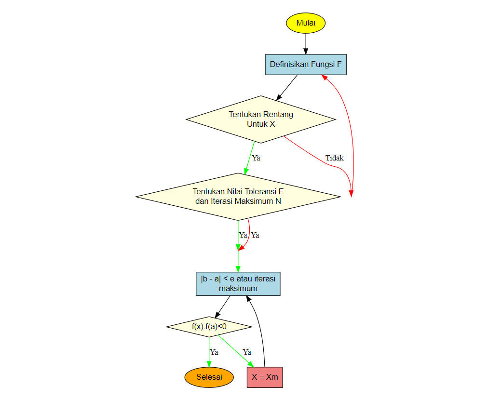

```{css, echo=FALSE}
/* CSS untuk posisi logo di pojok kiri bawah */

/* Secara default, sembunyikan logo di semua ukuran layar (Mobile First) */
.sidebar-logo {
  display: none;
}

/* TAMPILKAN logo di pojok kiri bawah untuk layar desktop */
@media (min-width: 1200px) {
  .sidebar-logo {
    display: flex;
    position: fixed;
    /* POSISI POJOK KIRI BAWAH */
    bottom: 20px;   /* Jarak dari bawah layar */
    left: 20px;     /* Jarak dari kiri layar */
    z-index: 1000;
    width: 250px;
    height: 250px;
    background: rgba(17, 45, 50, 0.85);
    border-radius: 12px;
    box-shadow: 0 4px 16px rgba(0,198,255,0.25);
    align-items: center;
    justify-content: center;
    transition: transform 0.2s;
    overflow: hidden;
    border: 2px solid yellow;
  }
  
  /* Style untuk image di dalam logo */
  .sidebar-logo img {
    max-width: 90%;
    max-height: 90%;
    object-fit: contain;
  }
  
  /* Optional: Hover effect */
  .sidebar-logo:hover {
    transform: scale(1.05);
    box-shadow: 0 6px 20px rgba(0,198,255,0.35);
  }
}

/* Responsive: Untuk layar yang lebih kecil, posisikan dengan ukuran yang lebih kecil */
@media (min-width: 768px) and (max-width: 1199px) {
  .sidebar-logo {
    display: flex;
    position: fixed;
    bottom: 15px;
    left: 15px;
    z-index: 1000;
    width: 150px;   /* Ukuran lebih kecil untuk tablet */
    height: 150px;
    background: rgba(17, 45, 50, 0.85);
    border-radius: 8px;
    box-shadow: 0 3px 12px rgba(0,198,255,0.25);
    align-items: center;
    justify-content: center;
    transition: transform 0.2s;
    overflow: hidden;
  }
  
  .sidebar-logo img {
    max-width: 85%;
    max-height: 85%;
    object-fit: contain;
  }
}
```

<div class="sidebar-logo">
  
</div>

<!-- VIDEO YOUTUBE -->
```{r setup, include=FALSE}
knitr::opts_chunk$set(echo = TRUE)
library(knitr)
library("vembedr")
```
<div class="video-container">
```{r video, echo=FALSE,results='asis'}
embed_url("https://www.youtube.com/watch?v=Mk-HAyI3aoc&ab_channel=StudySession")
```
</div>
# Pendahuluan

Seiring kemajuan teknologi, berbagai persoalan dalam kehidupan sehari-hari kini banyak yang dimodelkan secara matematis di berbagai bidang ilmu. Namun, tidak semua permasalahan matematika dapat diselesaikan secara analitik. Oleh karena itu, diperlukan metode pendekatan lain, yaitu metode numerik.  

Metode numerik merupakan teknik yang digunakan untuk menyusun model matematika agar dapat diselesaikan melalui operasi hitung biasa. Meskipun metode ini dapat digunakan untuk menyelesaikan berbagai permasalahan, hasil yang diperoleh bersifat mendekati, bukan nilai eksak. Oleh karena itu, selalu ada tingkat kesalahan dalam hasil yang didapat. Dengan bantuan komputer, proses perhitungan metode numerik menjadi lebih cepat dan efisien.  

Dalam beberapa kasus, model matematika dapat berbentuk persamaan nonlinier. Persamaan nonlinier merupakan jenis persamaan yang memiliki variabel dengan pangkat lebih dari satu. Semakin tinggi pangkat variabel dalam persamaan tersebut, maka penyelesaiannya akan semakin kompleks. Namun, dengan bantuan metode numerik, proses pencarian solusi menjadi lebih mudah. Dua pendekatan numerik yang umum digunakan untuk menyelesaikan persamaan nonlinier adalah metode biseksi dan metode Newton-Raphson.  

> “Metode Newton-Raphson memiliki konvergensi yang lebih cepat dibandingkan metode biseksi.” — (Estuningsih dan Rosita 2019)

Namun demikian, dalam beberapa kasus, metode biseksi lebih disukai karena jaminan konvergensi dan kesederhanaannya.

## Tujuan

- Menjelaskan konsep dan algoritma metode biseksi  
- Mengimplementasikan metode biseksi dalam bahasa R  
- Melakukan eksplorasi numerik terhadap akar fungsi nonlinier dengan studi kasus  

# Metode Biseksi

Metode biseksi merupakan teknik untuk menemukan akar dari suatu persamaan polinomial dengan cara membagi suatu interval menjadi dua bagian. Metode ini didasarkan pada *teorema nilai antara* yang berlaku pada fungsi kontinu.  

Metode biseksi merupakan teknik untuk menemukan akar dari suatu [persamaan polinomial](https://www.cuemath.com/algebra/polynomial-equations/) dengan cara membagi suatu interval menjadi dua bagian. Metode ini didasarkan pada teorema nilai antara, yang berlaku pada fungsi kontinu. Proses pencarian akar dilakukan dengan mempersempit rentang interval di mana tanda fungsi berubah, yaitu dari positif ke negatif atau sebaliknya. Penyempitan dilakukan secara berulang dengan mengambil titik tengah dari interval sebagai pendekatan akar. Meskipun metode ini tergolong sederhana dan mudah diimplementasikan, kecepatan konvergensinya relatif lambat. Dalam literatur, metode ini juga dikenal dengan nama metode pembagian interval, metode pencarian akar, metode pencarian biner (binary search method), atau metode dikotomi.

Mari kita perhatikan suatu fungsi kontinu “f” yang didefinisikan pada interval tertutup [a, b], diberikan dengan f(a) dan f(b) yang bertanda berbeda. Maka berdasarkan teorema, terdapat suatu titik x yang termasuk dalam (a, b) yang mana f(x) = 0.

jadi, prinsip dari metode biseksi adalah mengurung akar fungsi pada interval x=[a,b] atau pada nilai x batas bawah a dan batas atas b. Selanjutnya interval tersebut terus menerus dibagi 2 hingga sekecil mungkin, sehingga nilai hampiran yang dicari dapat ditentukan dengan tingkat toleransi tertentu.

Proses pencarian akar dilakukan dengan mempersempit rentang interval di mana tanda fungsi berubah, yaitu dari positif ke negatif atau sebaliknya. Penyempitan dilakukan secara berulang dengan mengambil titik tengah dari interval sebagai pendekatan akar.  

Metode ini juga dikenal dengan nama metode pembagian interval, metode pencarian akar, metode pencarian biner (*binary search method*), atau metode dikotomi [Hafidz, 2021](https://rpubs.com/Hafidz/827225).

Rumus iteratif metode biseksi adalah:

$$
x_t = \frac{a + b}{2}
$$

Kemudian dilakukan evaluasi:

- Jika $f(a) \cdot f(x_t) < 0$, maka akar berada pada $[a, x_t]$
- Jika $f(x_t) \cdot f(b) < 0$, maka akar berada pada $[x_t, b]$

Sifat-sifat metode biseksi:

- Konvergensi lambat  
- Caranya mudah  
- Tidak dapat digunakan untuk mencari akar imaginer  
- Hanya dapat mencari satu akar pada satu siklus 

## Kelebihan dan Kekurangan Metode Biseksi

Berikut adalah ringkasan kelebihan dan kekurangan dari metode biseksi:

```{r echo=FALSE, results='asis'}
kelebihan <- c(
  "Algoritma sederhana dan mudah dipahami",
  "Selalu konvergen jika syarat \\( f(a) \\cdot f(b) < 0 \\) terpenuhi",
  "Tidak memerlukan turunan fungsi",
  "Stabil dan tidak mudah gagal (*reliable*)",
  "Cocok untuk fungsi kontinu dengan akar tunggal di interval tertentu"
)

kekurangan <- c(
  "Konvergensi lambat dibanding metode lain (misal Newton-Raphson)",
  "Hanya berlaku jika fungsi mengalami pergantian tanda pada interval",
  "Tidak cocok untuk akar ganda (akar berulang)",
  "Tidak memberikan informasi lokal seperti laju perubahan atau turunan",
  "Hanya dapat menemukan satu akar dalam satu interval pencarian"
)

tabel <- data.frame(Kelebihan = kelebihan,Kekurangan = kekurangan)

kable(tabel, align = "l", escape = FALSE)
```
## Algoritma Metode Biseksi

1. Definisikan fungsi $f(x)$  
2. Tentukan rentang untuk $x$ yang berupa batas bawah $a$ dan batas atas $b$  
3. Tentukan nilai toleransi $e$ dan iterasi maksimum $N$  
4. Hitung $f(a)$ dan $f(b)$  
5. Hitung nilai tengah:  
   $$ x = \frac{a + b}{2} \tag{7.5} $$  
6. Hitung $f(x)$  
7. Bila $f(x) \cdot f(a) < 0$, maka $b = x$ dan $f(b) = f(x)$  
   Bila tidak, $a = x$ dan $f(a) = f(x)$  
8. Bila $|b - a| < e$ atau iterasi maksimum tercapai, maka proses dihentikan dan akar $\approx x$  
   Bila tidak, ulangi langkah 6  
9. Jika sudah diperoleh nilai di bawah nilai toleransi, nilai akar selanjutnya dihitung berdasarkan Persamaan (7.5) dengan nilai $a$ dan $b$ sebagai nilai baru dari iterasi terakhir.

```{r flowchart, echo=FALSE, fig.cap="Gambar 1. Diagram alur metode biseksi", fig.align="center", out.width="50%"}

```

# Implementasi Fungsi R

```{r fungsi-biseksi}
biseksi <- function(f, a, b, tol = 1e-7, N = 100) {
  data <- data.frame(
    Iterasi = numeric(),
    a = numeric(),
    b = numeric(),
    x = numeric(),
    f_x = numeric()
  )
  
  iter <- 0
  while ((b - a) > tol && iter < N) {
    x <- (a + b) / 2
    fx <- f(x)
    iter <- iter + 1
    
    data <- rbind(data, data.frame(
      Iterasi = iter,
      a = a,
      b = b,
      x = x,
      f_x = fx
    ))
    
    if (f(a) * fx < 0) {
      b <- x
    } else {
      a <- x
    }
  }
  
  akar <- (a + b) / 2
  return(list(akar = akar, iterasi = iter, data = data))
}
```
**Studi Kasus**

Mencari akar dari fungsi:

$$
f(x) = x^3 - x - 2
$$

Dengan interval awal:

$$
[1, 2]
$$
```{r studi-kasus}
f <- function(x) x^3 - x - 2
hasil <- biseksi(f, 1, 2)
hasil$akar
```
**Tabel Iterasi**
```{r tabel-iterasi}
knitr::kable(head(hasil$data, 10), caption = "10 Iterasi Pertama Metode Biseksi")
```
**Visualisasi Fungsi dan Titik Akar**
```{r plot-fungsi, fig.align='center', fig.cap='Gambar 2. Vsiualisasi fungsi f(x) dan titik akar yang ditemukan'}

curve(f, from = 0, to = 3, col = "blue", lwd = 2, main = "Grafik f(x) = x^3 - x - 2", ylab = "f(x)")
abline(h = 0, col = "red", lty = 2)
points(hasil$akar, f(hasil$akar), col = "darkgreen", pch = 19)
text(hasil$akar, f(hasil$akar), labels = "Akar", pos = 3)

```


__Catatan__

> Metode biseksi hanya berlaku jika $f(a) \cdot f(b) < 0$.  
> Pastikan fungsi tidak memiliki diskontinuitas.  
>  
> Nilai toleransi biasanya ditulis sebagai $10^{-6}$ dan jumlah iterasi maksimal adalah $100~\textit{iterasi}$.

# Kesimpulan

Metode biseksi merupakan salah satu teknik paling sederhana namun andal dalam menyelesaikan persamaan nonlinier secara numerik. Metode ini bekerja berdasarkan prinsip *teorema nilai antara*, yaitu jika suatu fungsi kontinu memiliki tanda berbeda pada dua titik, maka terdapat setidaknya satu akar di antaranya.  

Dalam penerapannya, metode biseksi secara sistematis mempersempit interval pencarian akar dengan membagi dua interval dan memilih subinterval di mana terjadi perubahan tanda. Proses ini diulang hingga selisih antara batas bawah dan atas cukup kecil, sesuai dengan toleransi yang ditentukan.

Keunggulan utama metode biseksi adalah kestabilan dan jaminan konvergensi selama syarat \\( f(a) \\cdot f(b) < 0 \\) terpenuhi, tanpa memerlukan turunan fungsi. Namun, metode ini memiliki kelemahan berupa kecepatan konvergensi yang lambat dan tidak dapat digunakan untuk mencari akar ganda atau kompleks.

Dalam studi kasus fungsi \\( f(x) = x^3 - x - 2 \\), metode biseksi berhasil menemukan akar dengan cepat dan akurat menggunakan bahasa pemrograman R. Selain itu, visualisasi dan tabel iterasi membantu mempermudah pemahaman proses konvergensi metode ini.

Secara keseluruhan, metode biseksi sangat cocok digunakan dalam pembelajaran awal metode numerik karena algoritmanya yang sederhana dan hasilnya yang mudah diverifikasi secara grafis maupun numerik. Dokumentasi menggunakan R Markdown juga terbukti efektif dalam menyajikan analisis secara terintegrasi dan *reproducible*.


# Referensi

- Hafidz. (2021). *Persamaan Nonlinier dan Penyelesaiannya dengan R*. RPubs. [https://rpubs.com/Hafidz/827225](https://rpubs.com/Hafidz/827225)
- Estuningsih, S., & Rosita, D. (2019). *Analisis Numerik: Teori dan Aplikasi*. Yogyakarta: Deepublish.
- Moh. Rosidi. (n.d.). *Metode Numerik: Root Finding*. Bookdown.  
  [https://bookdown.org/moh_rosidi2610/Metode_Numerik/rootfinding.html](https://bookdown.org/moh_rosidi2610/Metode_Numerik/rootfinding.html)
  
Dokumen ini disusun menggunakan R Markdown, sebuah format penulisan dinamis yang memungkinkan integrasi antara teks naratif, kode R, dan output analisis dalam satu file. Dengan pendekatan ini, proses dokumentasi dan pelaporan hasil analisis metode numerik, seperti metode biseksi, menjadi lebih terstruktur dan reproducible. Penjelasan praktis mengenai R Markdown dapat ditemukan dalam buku *R for Data Science* di [https://r4ds.had.co.nz/r-markdown.html](https://r4ds.had.co.nz/r-markdown.html).